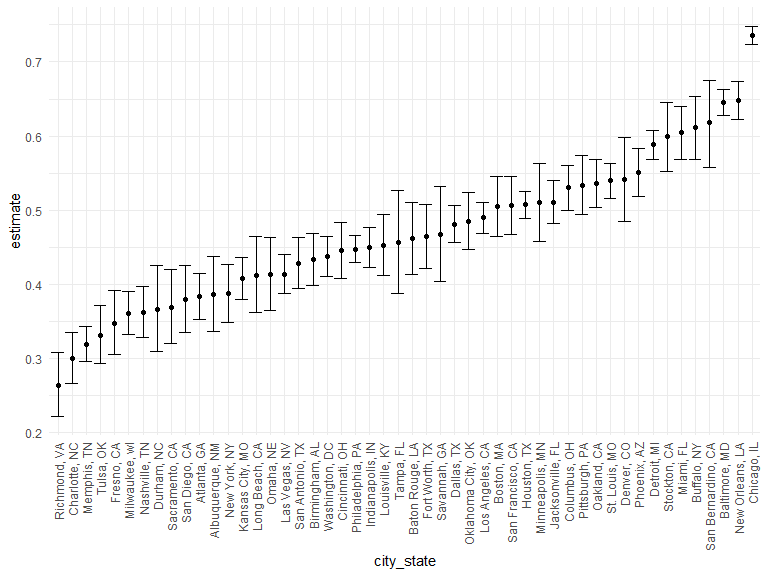
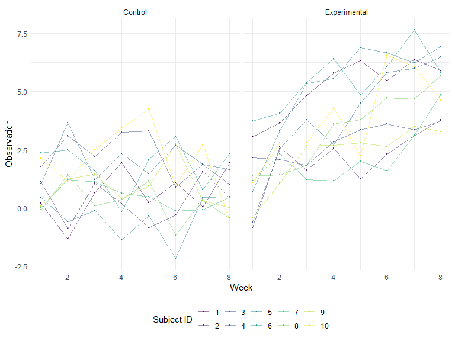

P8105_hw5
================
Zhezheng Jin
2023-11-10

## Problem 1

#### Data import

``` r
homicide <- read_csv("./data_file/homicide-data.csv")

homicide
```

    ## # A tibble: 52,179 × 12
    ##    uid        reported_date victim_last  victim_first victim_race victim_age
    ##    <chr>              <dbl> <chr>        <chr>        <chr>       <chr>     
    ##  1 Alb-000001      20100504 GARCIA       JUAN         Hispanic    78        
    ##  2 Alb-000002      20100216 MONTOYA      CAMERON      Hispanic    17        
    ##  3 Alb-000003      20100601 SATTERFIELD  VIVIANA      White       15        
    ##  4 Alb-000004      20100101 MENDIOLA     CARLOS       Hispanic    32        
    ##  5 Alb-000005      20100102 MULA         VIVIAN       White       72        
    ##  6 Alb-000006      20100126 BOOK         GERALDINE    White       91        
    ##  7 Alb-000007      20100127 MALDONADO    DAVID        Hispanic    52        
    ##  8 Alb-000008      20100127 MALDONADO    CONNIE       Hispanic    52        
    ##  9 Alb-000009      20100130 MARTIN-LEYVA GUSTAVO      White       56        
    ## 10 Alb-000010      20100210 HERRERA      ISRAEL       Hispanic    43        
    ## # ℹ 52,169 more rows
    ## # ℹ 6 more variables: victim_sex <chr>, city <chr>, state <chr>, lat <dbl>,
    ## #   lon <dbl>, disposition <chr>

Description:

This dataset has 52179 observations and 12 variables. There are 52179
number of observations of homicide cases in the 50 large U.S. cities and
12 variables, including uid, reported_date, victim_last, victim_first,
victim_race, victim_age, victim_sex, city, state, lat, lon, disposition.

#### Homicides within cities

``` r
homicide <-homicide %>%
  mutate(
    city_state = paste(city, state, sep=", "),
    unsolved = disposition %in% c("Closed without arrest", "Open/No arrest")
    ) %>%
  filter(city_state != "Tulsa, AL")

cities_sum <- homicide %>%
  group_by(city_state) %>%
  summarise(
    total_homicides = n(),
    unsolved_homicides = sum(unsolved, na.rm = TRUE)
  )

cities_sum
```

    ## # A tibble: 50 × 3
    ##    city_state      total_homicides unsolved_homicides
    ##    <chr>                     <int>              <int>
    ##  1 Albuquerque, NM             378                146
    ##  2 Atlanta, GA                 973                373
    ##  3 Baltimore, MD              2827               1825
    ##  4 Baton Rouge, LA             424                196
    ##  5 Birmingham, AL              800                347
    ##  6 Boston, MA                  614                310
    ##  7 Buffalo, NY                 521                319
    ##  8 Charlotte, NC               687                206
    ##  9 Chicago, IL                5535               4073
    ## 10 Cincinnati, OH              694                309
    ## # ℹ 40 more rows

#### Baltimore summary

``` r
baltimore_sum <-  
  cities_sum %>%
  filter(city_state == "Baltimore, MD")
baltimore_test <-
  prop.test(
  x = baltimore_sum %>% pull(unsolved_homicides),
  n = baltimore_sum %>% pull(total_homicides)
  ) %>%
  broom::tidy()

baltimore_test
```

    ## # A tibble: 1 × 8
    ##   estimate statistic  p.value parameter conf.low conf.high method    alternative
    ##      <dbl>     <dbl>    <dbl>     <int>    <dbl>     <dbl> <chr>     <chr>      
    ## 1    0.646      239. 6.46e-54         1    0.628     0.663 1-sample… two.sided

#### Summary of each city

``` r
prop_test_city <- function(unsolved, total) {
    test_result <- prop.test(x = unsolved, n = total)
    return(test_result)
    }

cities_proportion <- cities_sum %>%
  mutate(
    prop_test_result = map2(unsolved_homicides, total_homicides, prop_test_city),
    tidy_results = map(prop_test_result, broom::tidy)
  ) %>%
  select(city_state, tidy_results) %>%
  unnest(tidy_results) %>%
  select(city_state, estimate, conf.low, conf.high)

cities_proportion
```

    ## # A tibble: 50 × 4
    ##    city_state      estimate conf.low conf.high
    ##    <chr>              <dbl>    <dbl>     <dbl>
    ##  1 Albuquerque, NM    0.386    0.337     0.438
    ##  2 Atlanta, GA        0.383    0.353     0.415
    ##  3 Baltimore, MD      0.646    0.628     0.663
    ##  4 Baton Rouge, LA    0.462    0.414     0.511
    ##  5 Birmingham, AL     0.434    0.399     0.469
    ##  6 Boston, MA         0.505    0.465     0.545
    ##  7 Buffalo, NY        0.612    0.569     0.654
    ##  8 Charlotte, NC      0.300    0.266     0.336
    ##  9 Chicago, IL        0.736    0.724     0.747
    ## 10 Cincinnati, OH     0.445    0.408     0.483
    ## # ℹ 40 more rows

#### Plot: Estimated proportion of unsolved homicides & CIs by city

``` r
cities_proportion %>% 
  mutate(city_state = fct_reorder(city_state, estimate)) %>%
  ggplot(aes(x = city_state, y = estimate)) +
  geom_point() +
  geom_errorbar(aes(ymin = conf.low, ymax = conf.high)) +
  theme(axis.text.x = element_text(angle = 90, vjust = 0.5, hjust=1))
```



## Problem 2

#### Data import and combination

``` r
df <- 
  tibble(list.files("./data_file/data_q2")) %>%
  mutate(file_list = paste(list.files("./data_file/data_q2")))

read_files <- function(x) {
  
    data = read_csv(paste0("./data_file/data_q2/", x)) %>%
      mutate(file_names = x)
}

longitudinal_data <- map_df(df$file_list, read_files)

longitudinal_data
```

    ## # A tibble: 20 × 9
    ##    week_1 week_2 week_3 week_4 week_5 week_6 week_7 week_8 file_names
    ##     <dbl>  <dbl>  <dbl>  <dbl>  <dbl>  <dbl>  <dbl>  <dbl> <chr>     
    ##  1   0.2   -1.31   0.66   1.96   0.23   1.09   0.05   1.94 con_01.csv
    ##  2   1.13  -0.88   1.07   0.17  -0.83  -0.31   1.58   0.44 con_02.csv
    ##  3   1.77   3.11   2.22   3.26   3.31   0.89   1.88   1.01 con_03.csv
    ##  4   1.04   3.66   1.22   2.33   1.47   2.7    1.87   1.66 con_04.csv
    ##  5   0.47  -0.58  -0.09  -1.37  -0.32  -2.17   0.45   0.48 con_05.csv
    ##  6   2.37   2.5    1.59  -0.16   2.08   3.07   0.78   2.35 con_06.csv
    ##  7   0.03   1.21   1.13   0.64   0.49  -0.12  -0.07   0.46 con_07.csv
    ##  8  -0.08   1.42   0.09   0.36   1.18  -1.16   0.33  -0.44 con_08.csv
    ##  9   0.08   1.24   1.44   0.41   0.95   2.75   0.3    0.03 con_09.csv
    ## 10   2.14   1.15   2.52   3.44   4.26   0.97   2.73  -0.53 con_10.csv
    ## 11   3.05   3.67   4.84   5.8    6.33   5.46   6.38   5.91 exp_01.csv
    ## 12  -0.84   2.63   1.64   2.58   1.24   2.32   3.11   3.78 exp_02.csv
    ## 13   2.15   2.08   1.82   2.84   3.36   3.61   3.37   3.74 exp_03.csv
    ## 14  -0.62   2.54   3.78   2.73   4.49   5.82   6      6.49 exp_04.csv
    ## 15   0.7    3.33   5.34   5.57   6.9    6.66   6.24   6.95 exp_05.csv
    ## 16   3.73   4.08   5.4    6.41   4.87   6.09   7.66   5.83 exp_06.csv
    ## 17   1.18   2.35   1.23   1.17   2.02   1.61   3.13   4.88 exp_07.csv
    ## 18   1.37   1.43   1.84   3.6    3.8    4.72   4.68   5.7  exp_08.csv
    ## 19  -0.4    1.08   2.66   2.7    2.8    2.64   3.51   3.27 exp_09.csv
    ## 20   1.09   2.8    2.8    4.3    2.25   6.57   6.09   4.64 exp_10.csv

#### Tidy dataset

``` r
longitudinal_tidy <- longitudinal_data %>%
  clean_names() %>%
  mutate(group = ifelse(grepl("con", file_names), "Control", "Experimental")) %>%
  mutate(subject_ID = as.integer(str_extract(file_names, "[0-9][0-9]"))) %>%
  select(-file_names) %>%
  pivot_longer(
    cols = starts_with("week"),
    names_to = "week",
    values_to = "observation"
  ) %>%
  mutate(week = as.numeric(gsub("week_", "", week)))

longitudinal_tidy
```

    ## # A tibble: 160 × 4
    ##    group   subject_ID  week observation
    ##    <chr>        <int> <dbl>       <dbl>
    ##  1 Control          1     1        0.2 
    ##  2 Control          1     2       -1.31
    ##  3 Control          1     3        0.66
    ##  4 Control          1     4        1.96
    ##  5 Control          1     5        0.23
    ##  6 Control          1     6        1.09
    ##  7 Control          1     7        0.05
    ##  8 Control          1     8        1.94
    ##  9 Control          2     1        1.13
    ## 10 Control          2     2       -0.88
    ## # ℹ 150 more rows

#### Spaghetti plot: Observations on Each Subject over 8 Weeks between Two Groups

``` r
longitudinal_tidy %>% 
  ggplot(aes(x = week, y =observation, color = as.factor(subject_ID))) +
  geom_point(size=0.2) +
  geom_line(aes(group = subject_ID), alpha=0.5) +
  facet_grid(~group) +
  labs(x = "Week", y = "Observation", col = "Subject ID")
```



This plot reveals a distinct contrast between the control and
experimental groups: the control group’s observations fluctuate
significantly over the eight-week period without exhibiting a clear
trend, suggesting high variability and no consistent response. In
contrast, the experimental group displays a pronounced upward trend in
observations, implying a systematic increase over time which suggests
that the experimental condition or treatment might be having a positive
and more uniform effect on the subjects.

## Problem 3
